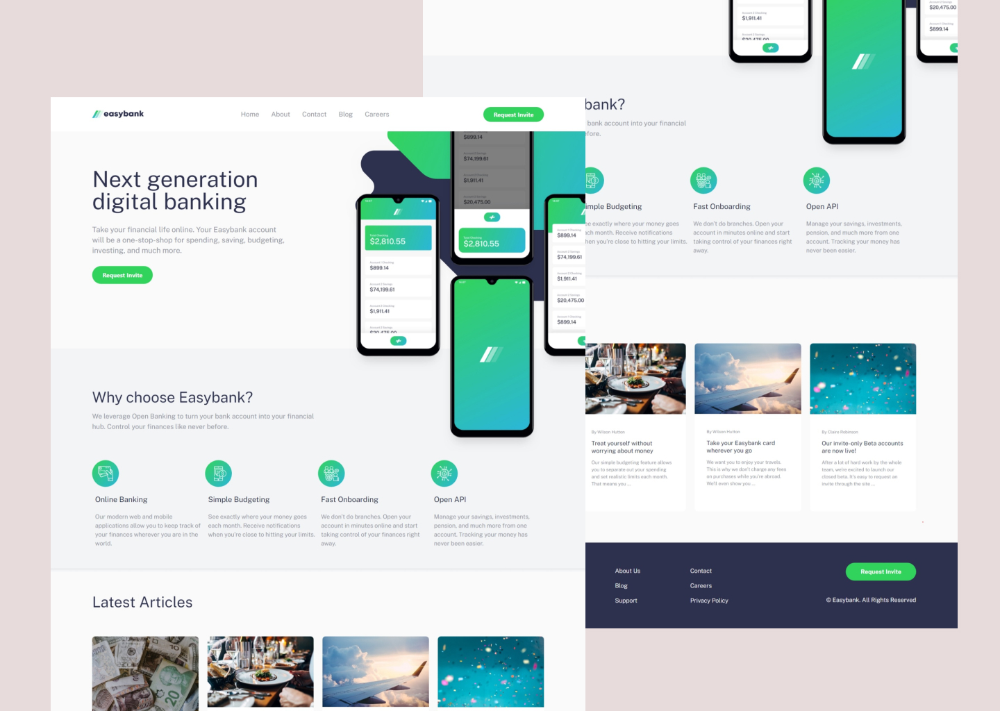
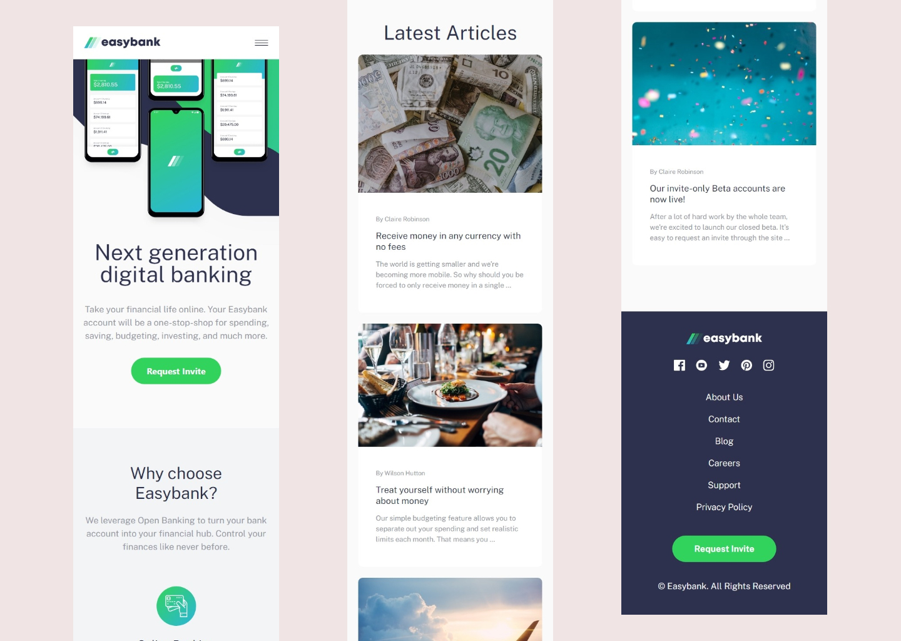

# Frontend Mentor - Easybank landing page solution

This is a solution to the [Easybank landing page challenge on Frontend Mentor](https://www.frontendmentor.io/challenges/easybank-landing-page-WaUhkoDN). Frontend Mentor challenges help you improve your coding skills by building realistic projects.

## Table of contents

- [Overview](#overview)
  - [The challenge](#the-challenge)
  - [Screenshot](#screenshot)
  - [Links](#links)
- [My process](#my-process)
  - [Built with](#built-with)
  - [What I learned](#what-i-learned)
- [Author](#author)

## Overview

### The challenge

Users should be able to:

- View the optimal layout for the site depending on their device's screen size
- See hover states for all interactive elements on the page

### Screenshot




### Links

- Solution URL: [Add solution URL here](https://your-solution-url.com)
- Live Site URL: [Add live site URL here](https://your-live-site-url.com)

## My process

### Built with

- Semantic HTML5 markup
- CSS custom properties
- Flexbox
- CSS Grid
- Mobile-first workflow
- Tailwind CSS
- [React](https://reactjs.org/) - JS library

**Note: These are just examples. Delete this note and replace the list above with your own choices**

### What I learned

Display navbar menu when the screen size changed.

To see how you can add code snippets, see below:

```jsx
const [showMenu, setShowMenu] = useState(false);
const [isMediumScreen, setMediumScreen] = useState(false);

function HamburgerClick() {
  setShowMenu(!showMenu);
}

// Function to check the screen size and update the state accordingly
function checkScreenSize() {
  if (window.innerWidth >= 768) {
    setShowMenu(true); // Close the menu on medium screens
  } else {
    setShowMenu(false);
  }
}
// Use useEffect to add a listener for screen size changes
useEffect(() => {
  checkScreenSize(); // Check screen size on initial render
  window.addEventListener("resize", checkScreenSize); // Add a listener for resize events

  return () => {
    // Cleanup: remove the resize listener when the component unmounts
    window.removeEventListener("resize", checkScreenSize);
  };
}, []);

return <div>{showMenu && <MenuHamburger />}</div>;
```

## Author

- Website - [Add your name here](https://www.your-site.com)
- Frontend Mentor - [@yourusername](https://www.frontendmentor.io/profile/yourusername)
